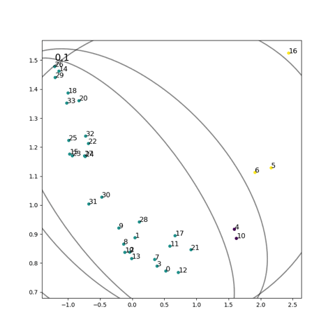

# ComE_BGMM

Master Thesis [**Community Embeddings with Bayesian Gaussian Mixture Model and Variational Inference**](https://github.com/abegehr/MT-workspace/blob/master/thesis/thesis.pdf) by Anton Begehr, 2020, HSE Moscow and University Passau, Germany. 

Based on implementation of the paper 
**Learning Community Embedding with Community Detection and Node Embedding on Graphs** by Cavallari et.al., 2017, Singapor. The original ComE from [andompesta/ComE](https://github.com/andompesta/ComE) was altered by taking a Bayesian-approach to community embedding.

## Animation

Animation of ComE BGMM+VI on Karate Club dataset:

## Conda Environment BICE

The core algorithm is written in Cython, so a miniconda environment file is provided to run our code. 

To create the BICE conda environment from environment.yml, run `conda env create -f environment.yml` and activate with `conda activate BICE`.

More details on conda environments here: https://docs.conda.io/projects/conda/en/latest/user-guide/tasks/manage-environments.html#creating-an-environment-from-an-environment-yml-file

## GMM => BGMM

Using `sklearn.mixture.BayesianGaussianMixture` for community embeddings.
